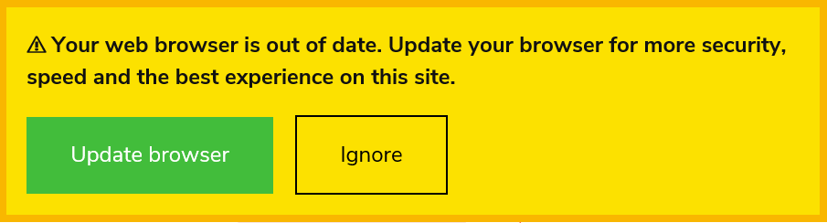

# nomodule-browser-warning.js

[](https://nodei.co/npm/nomodule-browser-warning.js/) 
[](https://www.npmjs.com/package/nomodule-browser-warning.js)

## How to use

Simple include the following script in your head. It will be ignored by browser supporting the module attribute.

Since js modules are supported by most browsers since 2018, showing this warning is a good way to run your
javascript on modern browsers without having to rely on polyfills or transpiling.

The best thing in this is that it will have NO impact on performance on modern browsers that will simply
ignore this line (and therefore keep your lighthouse results up ;-) ).

```html
<head>
...
<script src="/js/nomodule-browser-warning.js" nomodule defer id="nomodule-browser-warning"></script>
</head>
```

## How to configure

The script support the following data-attributes:
- data-text: The text displayed in the notification
- data-update-text: The label for the update button
- data-ignore-text: The label for the ignore button
- data-link: The link when you click on 'update' (https://browsehappy.com/ by default)
- data-cookie: Shoud we store ignore in a cookie? (true, by default)

## How does it look ?


